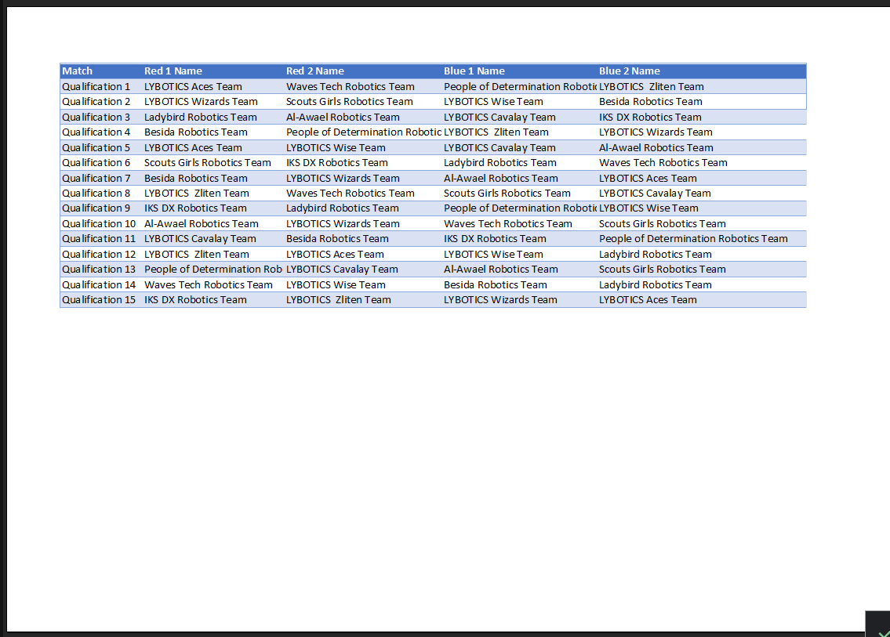
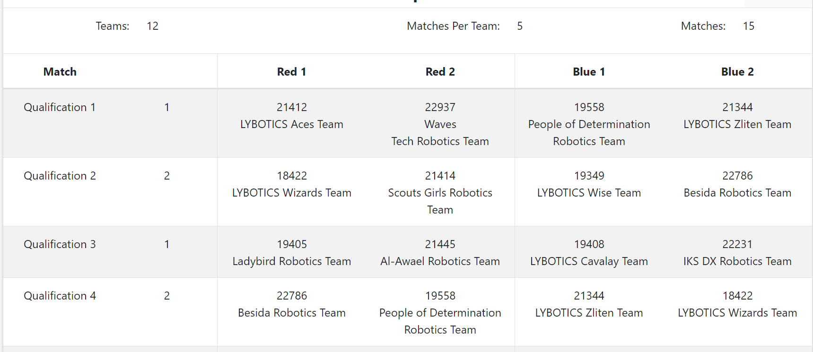

# ejstable
in the FTC Tripoli Qualification  we had an issue with the FIRST Tech Challenge Live Scorekeeper Software that when we print the Schedule like this:

this was challenging to the volunteer that had queue role which is bring team as fast as possible from the booths to the fields so I was at first I made excel file that I peaste teams numbers and it gets names using VLOOKUP function then I when I print it it was horrible and hard to see even harder than the origile one then one of the queue asked me why it couldn't just be the same? 

after that I took ejs in my university and I kept wondering about the input and I was sure that excel is easy to use so I made excel in my input and the workflow would be like this: create matchs in FTC Scoring system then copy teams numbers (for people have done it before less than 30 secs) and then just run run.bat and you will be redireted to the browser with the following output and you can easily print it

btw I even added Field toggle if it was one field event and doesn't need the field number
I hope this shows my problem solving skills thanks you
